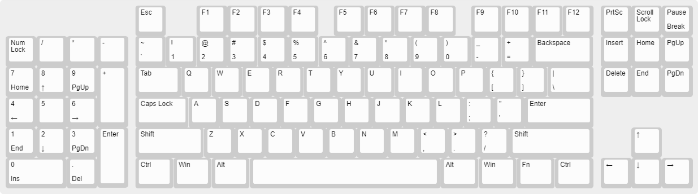
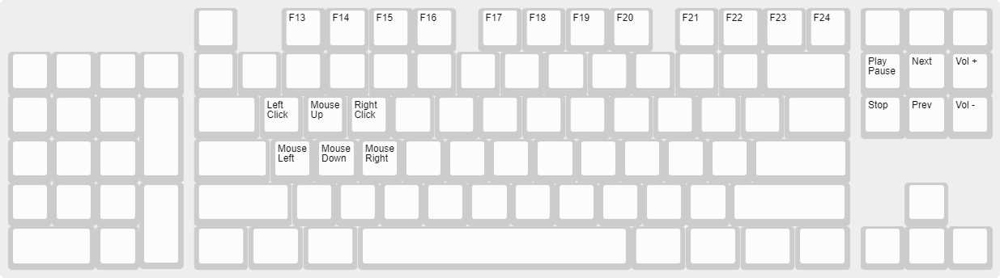

# KVT
Open source southpaw mechanical keyboard. This Github comes with both the project files and libraries used on the project.
Note I do not own the libraries used, I have only modified them to fit my needs.

## Features
* USB Type-C
* Southpaw Layout
* All Through Hole Components
* QMK

## Components Needed
* Proton_C: 1
* KVT PCB: 1
* MX Style Switches: 104
* 1N4148 Through Hole Diodes: 104
* JS102011SAQN Switch: 1
* 470Ω resistors: 104
* LEDs: 104


## Installing and Compiling
To install QMK visit QMK's official website https://docs.qmk.fm/#/

You will need all the sub-modules to compile the firmware**

After installation you need to compile the firmware; To compile the firmware for the Proton_C type this into the terminal after installing QMK

```
 make kv\revT:default
```
## Keymaps
##### Default Keymap


##### FN Layer Keymap


## Warning
KiCad 5.1.2 or above is needed to open this project. KiCad 4 or below won't work.

## Notes
I made this keyboard for a personal project, I am new to the circuit/keyboard designing in game. If you have any suggestions on improving the design in any form or fashion. If you open the pcb design you will see a bunch of numbers to the left of the finished design, those are spacing numbers for the footprints that I used.   
